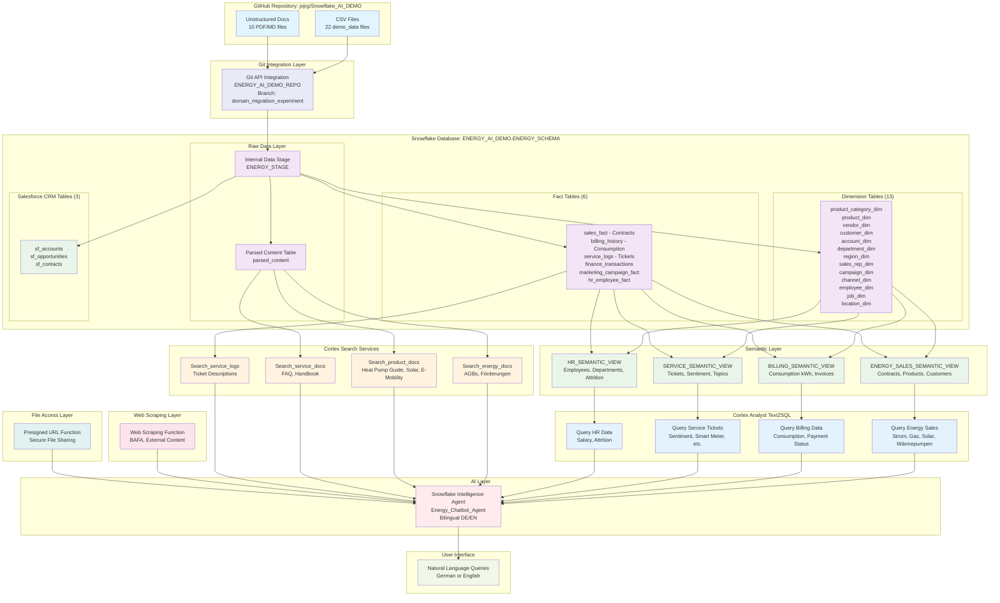

# EPOWER Energy Intelligence Demo

**Copy, Paste, Run & Done in less than 10 mins!**

**Just run the SQL script as an ACCOUNTADMIN as-is & your are done!**

This project demonstrates the comprehensive Snowflake Intelligence capabilities adapted for a **German Energy Retail (B2C)** use case, simulating EPOWER - a German energy provider offering:
- **Strom & Gas** - Traditional electricity and gas tariffs
- **Future Energy Home** - Solar panels, heat pumps, battery storage
- **Smart Home** - Smart meters, energy management systems
- **E-Mobility** - Wallbox charging stations, EV tariffs

## Key Components

### 1. Data Infrastructure
- **Star Schema Design**: 13 dimension tables and 6 fact tables covering Energy Sales, Billing, Service, Finance, Marketing, HR
- **Salesforce CRM Integration**: 3 Salesforce tables (Accounts, Opportunities, Contacts) for complete customer journey tracking
- **Automated Data Loading**: Git integration pulls data from GitHub repository (branch: `domain_migratiion_experiment`)
- **German Energy Domain Data**: 80,000+ records with realistic German names, cities, and energy-specific data
- **Database**: `ENERGY_AI_DEMO` with schema `ENERGY_SCHEMA`
- **Warehouse**: `ENERGY_INTELLIGENCE_DEMO_WH` (XSMALL with auto-suspend/resume)

### 2. Semantic Views (4 Business Domains)
- **Energy Sales Semantic View**: Contracts, products (Strom, Gas, Solar, Heat Pumps), customers, regions, consultants
- **Billing Semantic View**: Energy consumption (kWh), monthly invoices, payment status for Electricity and Gas
- **Service Semantic View**: Customer service tickets with sentiment analysis, topics (Smart Meter, Wärmepumpe, Solar)
- **HR Semantic View**: Employee data, departments, jobs, locations, attrition

### 3. Cortex Search Services (4 Domain-Specific)
- **Energy Documents**: Terms & conditions, subsidy information (Wärmepumpen-Förderung), vendor policies
- **Product Documents**: Heat pump efficiency guide, smart meter installation, solar battery quickstart, E-Mobility tariffs
- **Service Documents**: Invoice explanation FAQ, energy efficiency tips, customer service handbook
- **Service Logs Search**: Semantic search over customer service ticket descriptions

### 4. Snowflake Intelligence Agent
- **Multi-Tool Agent**: Combines Cortex Search, Cortex Analyst, Web Scraping, and File Access capabilities
- **Cross-Domain Analysis**: Can query all business domains and documents
- **Bilingual Support**: Responds in German or English based on query language
- **Web Content Analysis**: Can scrape and analyze content from any web URL (e.g., BAFA subsidy information)
- **File Sharing**: Can generate presigned URLs for temporary access to internal stage files
- **Visualization Support**: Generates charts and visualizations for data insights

### 5. GitHub Integration
- **Repository**: `https://github.com/jojrg/Snowflake_AI_DEMO.git`
- **Branch**: `domain_migratiion_experiment`
- **Data Path**: `migration_energy_reteil_experiment/`
- **Automated Sync**: Pulls demo data and unstructured documents
- **File Processing**: Parses PDF documents using Cortex Parse for search indexing

## Architecture Diagram

The following diagram shows how all components work together in the EPOWER Energy Intelligence Demo:



### Data Flow Explanation:
1. **Source Repository**: GitHub repository contains CSV files (22 demo data files) and unstructured documents (10 PDF/MD files)
2. **Git Integration**: Git API Integration syncs files from branch `domain_migratiion_experiment` to Snowflake's internal stage
3. **Structured Data**: CSV files populate 13 dimension tables and 6 fact tables (including energy-specific billing_history and service_logs)
4. **Salesforce CRM Data**: 3 Salesforce tables provide customer journey tracking
5. **Unstructured Data**: PDF/MD documents are parsed and stored in the `parsed_content` table
6. **Semantic Layer**: 4 business-specific semantic views with German synonyms enable natural language queries
7. **Cortex Analyst Layer**: Each semantic view connects to a Text2SQL service for natural language to SQL conversion
8. **Search Services**: 4 Cortex Search services enable vector search over documents and service logs
9. **AI Orchestration**: The Energy Chatbot Agent orchestrates between all services
10. **User Access**: Users interact through natural language queries in German or English

## Database Schema

### Dimension Tables (13)
- `product_category_dim` - Energy categories: Electricity, Gas, Solar, Heat Pumps, Smart Home, E-Mobility
- `product_dim` - 27 EPOWER products/tariffs
- `customer_dim` - 1,000 German residential and business customers with housing type
- `vendor_dim` - Installation partners and service providers
- `account_dim`, `department_dim`, `region_dim` (North, South, West, East)
- `sales_rep_dim` - Energy consultants
- `campaign_dim`, `channel_dim`, `employee_dim`, `job_dim`, `location_dim`

### Fact Tables (6)
- `sales_fact` - Energy contracts (12,000 records) - Amount in EUR, Units in kWh or count
- `billing_history` - Monthly consumption and billing (25,540 records) - kWh, payment status
- `service_logs` - Customer service tickets (5,000 records) - Topic, sentiment, priority
- `finance_transactions` - Financial transactions across departments
- `marketing_campaign_fact` - Campaign performance metrics
- `hr_employee_fact` - Employee data with salary and attrition

### Salesforce CRM Tables (3)
- `sf_accounts` - Customer accounts linked to customer_dim (1,000 records)
- `sf_opportunities` - Sales pipeline and revenue data (25,000 records)
- `sf_contacts` - Contact records with campaign attribution (37,000 records)

## Setup Instructions

**Single Script Setup**: The entire demo environment is created with one script:

1. **Run the complete setup script**:
   ```sql
   -- Execute in Snowflake worksheet as ACCOUNTADMIN
   -- Copy contents from: migration_energy_reteil_experiment/scripts/setup.sql
   ```

2. **What the script creates**:
   - `Energy_Intelligence_Demo` role and permissions
   - `ENERGY_INTELLIGENCE_DEMO_WH` warehouse
   - `ENERGY_AI_DEMO.ENERGY_SCHEMA` database and schema
   - Git repository integration (branch: domain_migratiion_experiment)
   - All dimension and fact tables with data
   - 4 semantic views for Cortex Analyst
   - 4 Cortex Search services for documents
   - Web scraping function with external access integration
   - Presigned URL function for secure file access
   - 1 Snowflake Intelligence Agent (Energy_Chatbot_Agent)

3. **Post-Setup Verification**:
   ```sql
   SHOW TABLES;                    -- Verify 19 tables created
   SHOW SEMANTIC VIEWS;            -- Verify 4 semantic views
   SHOW CORTEX SEARCH SERVICES;    -- Verify 4 search services
   SHOW AGENTS;                    -- Verify Energy_Chatbot_Agent
   ```

## Agent Capabilities

The Energy Chatbot Agent can:
- **Analyze energy contracts** across product categories (Strom, Gas, Solar, Heat Pumps, Smart Home, E-Mobility)
- **Query consumption data** with kWh analysis and housing type correlations
- **Analyze service tickets** with sentiment filtering and topic-based search
- **Search unstructured documents** for policies, guides, and FAQs
- **Scrape and analyze web content** (e.g., BAFA subsidy information, energy prices)
- **Generate presigned URLs** for secure file sharing
- **Respond bilingually** in German or English
- **Generate visualizations** for trends, comparisons, and analytics

## Demo Script: Energy Domain Analysis

### Energy Contracts & Products
1. **Product Overview**  
   "Gib mir einen Überblick über unser Produktportfolio. Welche Kategorien und Produkte bieten wir an?"

2. **Sales Trends**  
   "Zeige mir die monatlichen Vertragszahlen für 2024. Wie hat sich der Umsatz entwickelt?"

3. **Regional Analysis**  
   "Which region has the highest sales for Heat Pump products?"

### Consumption & Billing Analysis
1. **Cross-Domain Query**  
   "Was ist der durchschnittliche Stromverbrauch für Kunden mit Wärmepumpen in Hamburg?"

2. **Payment Analysis**  
   "Wie ist der Zahlungsstatus unserer Rechnungen aufgeteilt?"

3. **Housing Type Correlation**  
   "Compare average electricity consumption by housing type (Einfamilienhaus vs. Wohnung)"

### Customer Service Analysis
1. **Sentiment Analysis**  
   "Zeige mir alle negativen Service-Tickets zum Thema Smart Meter."

2. **Topic Breakdown**  
   "What are the most common service ticket topics? Show priority distribution."

3. **Resolution Time**  
   "Welche Tickets sind noch offen und haben hohe Priorität?"

### Document Search (RAG)
1. **Subsidy Information**  
   "Was sind die Voraussetzungen für die Wärmepumpen-Förderung 2024?"

2. **Product Guidance**  
   "Was ist der Unterschied zwischen einer Luft-Wasser und einer Sole-Wasser Wärmepumpe?"

3. **Invoice Help**  
   "Erkläre mir, wie ich meine Stromrechnung lesen kann."

### Web Scraping & External Data
1. **Current Subsidies**  
   "Hole mir aktuelle Informationen von der BAFA-Webseite zu Wärmepumpen-Förderung."

2. **Market Research**  
   "Analyze the content from [energy news URL] and summarize key trends."

## Data Model

The demo uses **Semantic Views** to expose the underlying star schema to Cortex Analyst. Each semantic view maps physical tables with business vocabulary (German/English synonyms), relationships, facts (measures), dimensions (attributes), and pre-defined metrics.

### 1. ENERGY_SALES_SEMANTIC_VIEW

Analyzes energy contracts, products, customers, and regional sales performance.

```
                                    ┌───────────────────────┐
                                    │  PRODUCT_CATEGORY_DIM │
                                    │  (Kategorien)         │
                                    │  ─────────────────────│
                                    │  category_key (PK)    │
                                    │  category_name        │
                                    │  vertical             │
                                    └───────────┬───────────┘
                                                │
┌───────────────────┐                           │
│    REGION_DIM     │                           │
│    (Regionen)     │      ┌───────────────────┴───────────────────┐
│  ─────────────────│      │              PRODUCT_DIM              │
│  region_key (PK)  │      │              (Produkte/Tarife)        │
│  region_name      │      │  ─────────────────────────────────────│
│  (North/South/    │      │  product_key (PK)                     │
│   West/East)      │      │  product_name, category_key (FK)      │
└────────┬──────────┘      │  category_name, vertical              │
         │                 └───────────────────┬───────────────────┘
         │                                     │
         │          ┌──────────────────────────┼──────────────────────────┐
         │          │                          │                          │
         │          │      ┌───────────────────┴───────────────────┐      │
         └──────────┼──────┤            SALES_FACT                 ├──────┼──────────┐
                    │      │            (Verträge/Contracts)       │      │          │
                    │      │  ─────────────────────────────────────│      │          │
                    │      │  sale_id (PK)                         │      │          │
                    │      │  customer_key (FK)  ──────────────────┼──────┘          │
                    │      │  product_key (FK)   ──────────────────┘                 │
                    │      │  region_key (FK)    ──────────────────┐                 │
                    │      │  sales_rep_key (FK) ──────────────────┼─────┐           │
                    │      │  vendor_key (FK)    ──────────────────┼─────┼─────┐     │
                    │      │  ─────────────────────────────────────│     │     │     │
                    │      │  date (dimension)                     │     │     │     │
                    │      │  amount (fact) - EUR                  │     │     │     │
                    │      │  units (fact) - kWh or count          │     │     │     │
                    │      └───────────────────────────────────────┘     │     │     │
                    │                                                    │     │     │
┌───────────────────┴───────────────────┐   ┌────────────────────┐      │     │     │
│           CUSTOMER_DIM                │   │    SALES_REP_DIM   │◄─────┘     │     │
│           (Kunden)                    │   │    (Berater)       │            │     │
│  ─────────────────────────────────────│   │  ──────────────────│            │     │
│  customer_key (PK)                    │   │  sales_rep_key (PK)│            │     │
│  customer_name, customer_type         │   │  rep_name          │            │     │
│  housing_type (Wohnform)              │   │  hire_date         │            │     │
│  city, state, zip, region_key (FK)    │   └────────────────────┘            │     │
└───────────────────────────────────────┘                                     │     │
                                            ┌─────────────────────────────────┘     │
                                            │                                       │
                                       ┌────┴───────────┐              ┌────────────┴────────────┐
                                       │   VENDOR_DIM   │              │       REGION_DIM        │
                                       │   (Partner)    │              │   (also linked to       │
                                       │  ─────────────-│              │    CUSTOMER_DIM)        │
                                       │  vendor_key(PK)│              └─────────────────────────┘
                                       │  vendor_name   │
                                       │  vendor_type   │
                                       └────────────────┘
```

**Facts (Measures):** `amount` (EUR), `units` (kWh/count), `contract_record` (count)  
**Key Metrics:** `TOTAL_REVENUE`, `TOTAL_CONTRACTS`, `AVERAGE_CONTRACT_VALUE`, `TOTAL_UNITS`  
**German Synonyms:** Verträge, Kunden, Produkte, Tarife, Berater, Regionen

---

### 2. BILLING_SEMANTIC_VIEW

Analyzes energy consumption (kWh) and billing/payment data.

```
┌───────────────────────────────────────┐
│           CUSTOMER_DIM                │
│           (Kunden)                    │
│  ─────────────────────────────────────│
│  customer_key (PK)                    │
│  customer_name                        │
│  housing_type (Wohnform)              │
│  city                                 │
└───────────────────┬───────────────────┘
                    │
                    │ 1:N
                    │
┌───────────────────┴───────────────────┐
│          BILLING_HISTORY              │
│          (Rechnungen/Abrechnungen)    │
│  ─────────────────────────────────────│
│  billing_id (PK)                      │
│  customer_key (FK)                    │
│  ─────────────────────────────────────│
│  billing_date (dimension)             │
│  billing_type (dimension)             │
│    → Electricity / Gas                │
│  payment_status (dimension)           │
│    → Bezahlt / Offen / Überfällig     │
│  ─────────────────────────────────────│
│  consumption_kwh (fact) - kWh         │
│  amount (fact) - EUR                  │
└───────────────────────────────────────┘
```

**Facts (Measures):** `consumption_kwh`, `amount` (EUR), `billing_record` (count)  
**Key Metrics:** `TOTAL_CONSUMPTION`, `AVERAGE_CONSUMPTION`, `TOTAL_BILLING_AMOUNT`, `TOTAL_INVOICES`  
**German Synonyms:** Rechnungen, Abrechnungen, Verbrauch, Zahlungsstatus

---

### 3. SERVICE_SEMANTIC_VIEW

Analyzes customer service tickets with sentiment analysis.

```
┌───────────────────────────────────────┐
│           CUSTOMER_DIM                │
│           (Kunden)                    │
│  ─────────────────────────────────────│
│  customer_key (PK)                    │
│  customer_name                        │
│  city                                 │
└───────────────────┬───────────────────┘
                    │
                    │ 1:N
                    │
┌───────────────────┴───────────────────┐
│           SERVICE_LOGS                │
│           (Tickets/Anfragen)          │
│  ─────────────────────────────────────│
│  log_id (PK)                          │
│  customer_key (FK)                    │
│  ─────────────────────────────────────│
│  log_date (dimension)                 │
│  topic (dimension)                    │
│    → Smart Meter, Rechnung,           │
│      Wärmepumpe, Solar, Tarif,        │
│      Wallbox, Allgemein               │
│  category (dimension)                 │
│    → Installation, Abrechnung,        │
│      Technisch, Vertrag, E-Mobility   │
│  sentiment (dimension)                │
│    → Positiv / Neutral / Negativ      │
│  channel (dimension)                  │
│    → Telefon, Email, Chat, App        │
│  priority (dimension)                 │
│    → Niedrig, Mittel, Hoch, Kritisch  │
│  description (dimension)              │
│  resolution_date (dimension)          │
│  ─────────────────────────────────────│
│  ticket_record (fact) = 1             │
└───────────────────────────────────────┘
```

**Facts (Measures):** `ticket_record` (count)  
**Key Metrics:** `TOTAL_TICKETS`, `NEGATIVE_TICKETS` (sentiment='Negativ')  
**German Synonyms:** Tickets, Anfragen, Kundenservice, Thema, Stimmung, Priorität

---

### 4. HR_SEMANTIC_VIEW

Analyzes employee data, salaries, and attrition.

```
                    ┌─────────────────┐
                    │  DEPARTMENT_DIM │
                    │  (Abteilungen)  │
                    │  ───────────────│
                    │  department_key │
                    │  department_name│
                    └────────┬────────┘
                             │
┌─────────────────┐          │          ┌─────────────────┐
│   EMPLOYEE_DIM  │          │          │     JOB_DIM     │
│   (Mitarbeiter) │          │          │    (Stellen)    │
│  ───────────────│          │          │  ───────────────│
│  employee_key   │          │          │  job_key        │
│  employee_name  │          │          │  job_title      │
│  gender         │          │          │  job_level      │
│  hire_date      │          │          └────────┬────────┘
└────────┬────────┘          │                   │
         │                   │                   │
         │         ┌─────────┴─────────┐         │
         └─────────┤  HR_EMPLOYEE_FACT ├─────────┘
                   │    (HR-Daten)     │
                   │  ─────────────────│
                   │  hr_fact_id (PK)  │
                   │  employee_key (FK)│
                   │  department_key   │
                   │  job_key (FK)     │
                   │  location_key (FK)├─────────────────┐
                   │  ─────────────────│                 │
                   │  date (dimension) │       ┌─────────┴─────────┐
                   │  salary (fact)EUR │       │   LOCATION_DIM    │
                   │  attrition_flag   │       │   (Standorte)     │
                   │    → 0=active     │       │  ─────────────────│
                   │    → 1=left       │       │  location_key     │
                   └───────────────────┘       │  location_name    │
                                               └───────────────────┘
```

**Facts (Measures):** `salary` (EUR), `attrition_flag` (0/1), `hr_record` (count), `employee_count`  
**Key Metrics:** `TOTAL_SALARY`, `AVG_SALARY`, `ATTRITION_COUNT`, `TOTAL_EMPLOYEES`  
**German Synonyms:** Mitarbeiter, Abteilungen, Stellen, Standorte, Gehalt, Fluktuation

---

## Data Volumes

| Table | Records |
|-------|---------|
| customer_dim | 1,000 |
| product_dim | 27 |
| sales_fact (Contracts) | 12,000 |
| billing_history | 25,540 |
| service_logs | 5,000 |
| sf_opportunities | 25,000 |
| sf_contacts | 37,000 |
| hr_employee_fact | 5,640 |

## Unstructured Documents (10)

| Category | Documents |
|----------|-----------|
| **Energy** | EPOWER_Green_Power_TCs_2024.pdf, Vendor_Management_Policy.pdf, Waermepumpe_Foerderung_2024.md |
| **Products** | Heat_Pump_Efficiency_Guide.pdf, Smart_Meter_Installation_Guide.pdf, Solar_Battery_Quickstart.md, E_Mobility_Tarife.md |
| **Service** | Invoice_Explanation_FAQ.pdf, Energy_Efficiency_Tips.pdf, Customer_Service_Handbook.pdf |

---

*EPOWER Energy Intelligence Demo - Powered by Snowflake*
