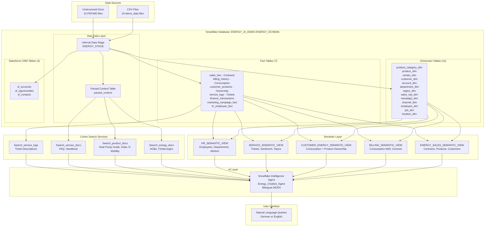

# EPOWER Energy Intelligence Demo


**Copy, Paste, Run & Done in less than 15 mins!**

**Just run the notebook cells in Snowflake Workspace as-is & you're done!**

This project demonstrates the comprehensive Snowflake Intelligence capabilities adapted for a **German Energy Retail (B2C)** use case, simulating EPOWER - a German energy provider offering:
- **Strom & Gas** - Traditional electricity and gas tariffs
- **Future Energy Home** - Solar panels, heat pumps, battery storage
- **Smart Home** - Smart meters, energy management systems
- **E-Mobility** - Wallbox charging stations, EV tariffs

## Key Components

### 1. Data Infrastructure
- **Star Schema Design**: 14 dimension tables, 7 fact tables, and 1 bridge table covering Energy Sales, Billing, Service, Finance, Marketing, HR
- **Product Ownership Tracking**: `customer_products` table links customers to their owned products (Heat Pumps, Solar, E-Mobility)
- **Cross-Domain Analysis**: Enables queries like "average consumption for customers with heat pumps in Hamburg"
- **German Energy Domain Data**: 600,000+ records with realistic German names, cities, and energy-specific data
- **Database**: `ENERGY_AI_DEMO` with schema `ENERGY_SCHEMA`
- **Warehouse**: `ENERGY_INTELLIGENCE_DEMO_WH` (XSMALL with auto-suspend/resume)

### 2. Semantic Views (5 Business Domains)
- **Energy Sales Semantic View**: Contracts, products (Strom, Gas, Solar, Heat Pumps), customers, regions, consultants
- **Billing Semantic View**: Energy consumption (kWh), monthly invoices, payment status for Electricity and Gas
- **Customer Energy Semantic View**: **NEW** - Combines billing, products, and customer data for cross-domain analysis
- **Service Semantic View**: Customer service tickets with sentiment analysis, topics (Smart Meter, Wärmepumpe, Solar)
- **HR Semantic View**: Employee data, departments, jobs, locations, attrition

### 3. Cortex Search Services (4 Domain-Specific)
- **Energy Documents**: Terms & conditions, subsidy information (Wärmepumpen-Förderung), vendor policies
- **Product Documents**: Heat pump efficiency guide, smart meter installation, solar battery quickstart, E-Mobility tariffs
- **Service Documents**: Invoice explanation FAQ, energy efficiency tips, customer service handbook
- **Service Logs Search**: Semantic search over customer service ticket descriptions

### 4. Snowflake Intelligence Agent
- **Multi-Tool Agent**: Combines Cortex Search, Cortex Analyst capabilities
- **Cross-Domain Analysis**: Can query consumption data for customers with specific products
- **Bilingual Support**: Responds in German or English based on query language
- **Visualization Support**: Generates charts and visualizations for data insights

## Architecture Diagram



## Database Schema

### Dimension Tables (14)
- `product_category_dim` - Energy categories: Electricity, Gas, Solar, Heat Pumps, Smart Home, E-Mobility
- `product_dim` - 27 EPOWER products/tariffs
- `customer_dim` - **20,000** German residential and business customers with housing type
- `vendor_dim` - Installation partners and service providers (200 vendors)
- `account_dim`, `department_dim`, `region_dim` (North, South, West, East)
- `sales_rep_dim` - Energy consultants (500 reps)
- `campaign_dim`, `channel_dim`, `employee_dim`, `job_dim`, `location_dim`

### Fact Tables (7)
- `sales_fact` - Energy contracts (**240,000 records**) - Amount in EUR, Units in kWh or count
- `billing_history` - Monthly consumption and billing (**~500,000 records**) - kWh, payment status
- `customer_products` - **NEW: Product ownership** (~40,000 records) - Links customers to products they own
- `service_logs` - Customer service tickets (**100,000 records**) - Topic, sentiment, priority
- `finance_transactions` - Financial transactions across departments
- `marketing_campaign_fact` - Campaign performance metrics
- `hr_employee_fact` - Employee data with salary and attrition

### Salesforce CRM Tables (3)
- `sf_accounts` - Customer accounts linked to customer_dim (20,000 records)
- `sf_opportunities` - Sales pipeline and revenue data (50,000 records)
- `sf_contacts` - Contact records with campaign attribution (75,000 records)

## Data Model - Customer Products (Cross-Domain Enabler)

The **customer_products** table is the key to enabling cross-domain analysis between billing (consumption) and sales (products):

```
┌───────────────────────────────────────┐
│           CUSTOMER_DIM                │
│           (20,000 Kunden)             │
│  ─────────────────────────────────────│
│  customer_key (PK)                    │
│  customer_name, customer_type         │
│  housing_type, city, state            │
└───────────────────┬───────────────────┘
                    │
         ┌──────────┴──────────┐
         │                     │
         ▼                     ▼
┌─────────────────────┐  ┌─────────────────────┐
│  BILLING_HISTORY    │  │  CUSTOMER_PRODUCTS  │
│  (Consumption)      │  │  (Product Ownership)│
│  ───────────────────│  │  ───────────────────│
│  billing_id (PK)    │  │  customer_product_id│
│  customer_key (FK)──┼──│──customer_key (FK)  │
│  billing_date       │  │  product_key (FK)───┼───┐
│  billing_type       │  │  category_key (FK)  │   │
│  consumption_kwh    │  │  category_name      │   │
│  amount             │  │  acquisition_date   │   │
│  payment_status     │  │  status             │   │
└─────────────────────┘  └─────────────────────┘   │
                                                   │
                                   ┌───────────────┘
                                   │
                                   ▼
                         ┌─────────────────────┐
                         │    PRODUCT_DIM      │
                         │  ───────────────────│
                         │  product_key (PK)   │
                         │  product_name       │
                         │  category_name      │
                         │  (Heat Pumps, Solar,│
                         │   E-Mobility, etc.) │
                         └─────────────────────┘
```

**This enables queries like:**
- "Average consumption for customers with heat pumps" → Join billing_history + customer_products + filter by category
- "Customers in Hamburg with solar installations" → Join customer_dim + customer_products + filter by city and category
- "Compare consumption between heat pump and non-heat pump customers" → Aggregate with product ownership flags

## Setup Instructions

**Notebook-Based Setup**: The entire demo environment is created by running the notebook:

1. **Open Snowflake Workspace** and create a new workspace from this Git repository

2. **Run the setup notebook**:
   - Open `notebooks/demo_setup.ipynb`
   - Run all cells sequentially

3. **What the notebook creates**:
   - `Energy_Intelligence_Demo` role and permissions
   - `ENERGY_INTELLIGENCE_DEMO_WH` warehouse
   - `ENERGY_AI_DEMO.ENERGY_SCHEMA` database and schema
   - All dimension and fact tables with data
   - 5 semantic views for Cortex Analyst (including Customer Energy view)
   - 4 Cortex Search services for documents
   - 1 Snowflake Intelligence Agent (Energy_Chatbot_Agent)

4. **Post-Setup Verification**:
   ```sql
   SHOW TABLES;                    -- Verify 23 tables created
   SHOW SEMANTIC VIEWS;            -- Verify 5 semantic views
   SHOW CORTEX SEARCH SERVICES;    -- Verify 4 search services
   SHOW AGENTS;                    -- Verify Energy_Chatbot_Agent
   ```

## Agent Capabilities

The Energy Chatbot Agent can:
- **Analyze energy contracts** across product categories (Strom, Gas, Solar, Heat Pumps, Smart Home, E-Mobility)
- **Query consumption data** with product ownership correlation (e.g., "heat pump customers in Hamburg")
- **Cross-domain analysis** combining billing, products, and customer data
- **Analyze service tickets** with sentiment filtering and topic-based search
- **Search unstructured documents** for policies, guides, and FAQs
- **Respond bilingually** in German or English
- **Generate visualizations** for trends, comparisons, and analytics

## Demo Script: Key Questions

### Cross-Domain Analysis (Structured Data - Multiple Tables)
- *"Was ist der durchschnittliche Stromverbrauch für Kunden mit Wärmepumpen in Hamburg?"*
- *"Vergleiche den Verbrauch zwischen Kunden mit und ohne Wärmepumpe"*
- *"Welche Kunden mit Solaranlagen haben überfällige Rechnungen?"*

### Combined Structured + Unstructured Data
- *"Wie viele Kunden haben Wärmepumpen und welche Wartungsintervalle gelten laut Dokumentation?"*
- *"Zeige mir Beschwerden zu Wärmepumpen und die zugehörigen Fehlercodes aus der Anleitung"*
- *"Kunden mit hohem Verbrauch - welche Energiespartipps sind relevant?"*

### Document Search (RAG)
- *"Was sind die Voraussetzungen für die Wärmepumpen-Förderung 2024?"*
- *"Erkläre mir, wie ich meine Stromrechnung lesen kann."*

## Data Volumes

| Table | Records |
|-------|---------|
| customer_dim | 20,000 |
| product_dim | 27 |
| customer_products | ~40,000 |
| sales_fact (Contracts) | 240,000 |
| billing_history | ~500,000 |
| service_logs | 100,000 |
| sf_opportunities | 50,000 |
| sf_contacts | 75,000 |
| hr_employee_fact | ~11,000 |

## Unstructured Documents (10)

| Category | Documents |
|----------|-----------|
| **Energy** | EPOWER_Green_Power_TCs_2024.pdf, Vendor_Management_Policy.pdf, Waermepumpe_Foerderung_2024.md |
| **Products** | Heat_Pump_Efficiency_Guide.pdf, Smart_Meter_Installation_Guide.pdf, Solar_Battery_Quickstart.md, E_Mobility_Tarife.md |
| **Service** | Invoice_Explanation_FAQ.pdf, Energy_Efficiency_Tips.pdf, Customer_Service_Handbook.pdf |

---

*EPOWER Energy Intelligence Demo - Powered by Snowflake*
