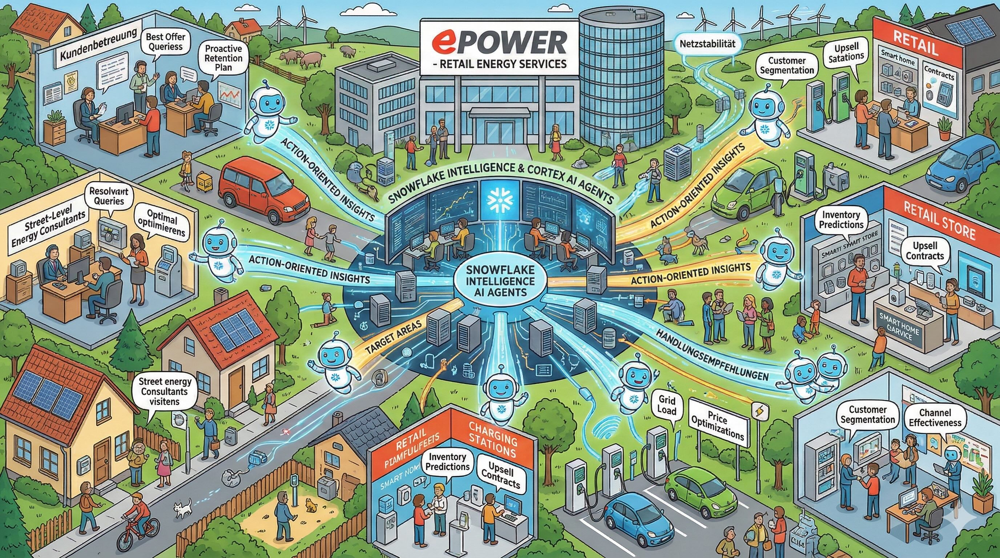
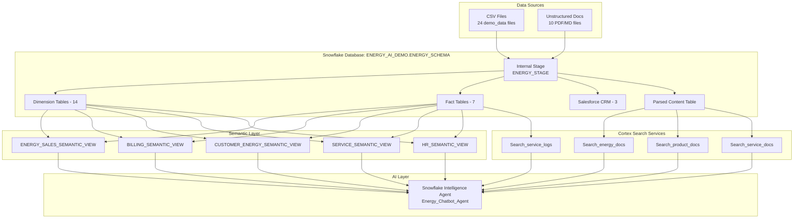

# EPOWER Energy Intelligence Demo



**Copy, Paste, Run & Done in less than 15 mins!**

---

## About EPOWER

**EPOWER Energie Deutschland GmbH** is a simulated German energy provider serving residential and business customers across all four regions of Germany (North, South, West, East). Founded with a vision to accelerate the German *Energiewende* (energy transition), EPOWER has evolved from a traditional electricity and gas supplier into a full-service energy partner offering future-ready solutions.

### Business Vision

EPOWER's mission is to make clean energy accessible to every German household and business. The company pursues a **360° Energy Strategy**:

1. **Supply** - Provide affordable electricity and gas tariffs
2. **Generate** - Enable customers to produce their own energy with solar installations
3. **Store** - Offer battery storage solutions for energy independence
4. **Heat** - Replace fossil fuel heating with efficient heat pumps
5. **Drive** - Support e-mobility with wallboxes and charging tariffs
6. **Optimize** - Help customers reduce consumption with smart home technology

### Company Profile

| Attribute | Value |
|-----------|-------|
| **Headquarters** | Hamburg, Germany |
| **Founded** | 2015 (simulated) |
| **Customers** | 20,000 (Residential & Business) |
| **Employees** | 1,000 |
| **Sales Representatives** | 500 |
| **Installation Partners** | 200 vendors across Germany |
| **Annual Contracts** | ~60,000 |
| **Service Tickets/Year** | ~35,000 |

---

## Product Portfolio

EPOWER offers products across **6 categories** organized into 3 business verticals:

### 🔌 Traditional Energy (Vertical: Energy)

| Category | Products | Description |
|----------|----------|-------------|
| **Electricity (Strom)** | Strom Basis, Strom Plus, Ökostrom 100%, Strom Fix 24, Wärmestrom | From budget-friendly basic tariffs to 100% renewable green electricity and special heat pump tariffs |
| **Gas** | Gas Basis, Gas Plus, Biogas 10%, Gas Fix 24 | Natural gas options including eco-friendly biogas blend |

### ☀️ Future Energy (Vertical: Future Energy)

| Category | Products | Description |
|----------|----------|-------------|
| **Solar** | Solar S (5kWp), Solar M (8kWp), Solar L (12kWp), SolarCloud, Speicher 5kWh, Speicher 10kWh | Rooftop solar systems of various sizes, virtual storage (cloud), and physical battery storage |
| **Heat Pumps (Wärmepumpen)** | Luft-Wasser, Sole-Wasser, Split, Kompakt | Air-to-water, ground-source, and compact heat pump systems for replacing gas/oil heating |

### 🏠 Smart Solutions

| Category | Products | Description |
|----------|----------|-------------|
| **Smart Home** | Smart Meter, Home Energy Manager, Smart Thermostat, Energy Monitor | Digital meters, home automation, and consumption monitoring devices |
| **E-Mobility** | Wallbox 11kW, Wallbox 22kW, Drive Tarif, Solar Carport | Home charging stations for electric vehicles and special EV charging tariffs |

---

## Customer Segments

EPOWER serves three distinct customer segments with different needs:

| Segment | Share | Typical Housing | Key Products |
|---------|-------|-----------------|--------------|
| **Privatkunde** (Residential) | 75% | Einfamilienhaus (35%), Wohnung (35%), Reihenhaus (20%), Mehrfamilienhaus (10%) | Electricity, Gas, Solar, Heat Pumps |
| **Kleingewerbe** (Small Business) | 18% | Mixed residential/commercial | Electricity, Smart Meters, Wallboxes |
| **Gewerbekunde** (Commercial) | 7% | Gewerbeimmobilie (Commercial property) | High-volume Electricity, Gas, Solar Systems |

### Regional Distribution

Customers are distributed across Germany's four regions based on population density:

| Region | Share | Major Cities |
|--------|-------|--------------|
| **West** | 30% | Köln, Düsseldorf, Dortmund, Essen, Duisburg, Bonn |
| **South** | 28% | München, Stuttgart, Nürnberg, Augsburg, Freiburg |
| **North** | 22% | Hamburg, Bremen, Kiel, Hannover, Rostock |
| **East** | 20% | Berlin, Dresden, Leipzig, Magdeburg, Erfurt |

---

## Data Domains

The demo covers **5 distinct business domains**, each with its own data model and analytics requirements:

### 1. 📊 Sales Domain

**Purpose**: Track energy contracts, product sales, and revenue

| Table | Records | Description |
|-------|---------|-------------|
| `sales_fact` | 240,000 | Energy contracts with amount (EUR) and units |
| `customer_dim` | 20,000 | Customer master data with housing type |
| `product_dim` | 27 | EPOWER products across 6 categories |
| `product_category_dim` | 6 | Product categories and verticals |
| `sales_rep_dim` | 500 | Energy consultants |
| `vendor_dim` | 200 | Installation and service partners |
| `region_dim` | 4 | North, South, West, East |

**Key Questions**:
- Which products are selling best in each region?
- How do sales compare between residential and business customers?
- Which sales representatives have the highest conversion rates?

---

### 2. ⚡ Billing & Consumption Domain

**Purpose**: Track energy usage, invoicing, and payments

| Table | Records | Description |
|-------|---------|-------------|
| `billing_history` | ~500,000 | Monthly electricity and gas bills |
| `customer_products` | ~40,000 | Product ownership (bridge table) |

**Key Metrics**:
- `consumption_kwh` - Energy consumed in kilowatt-hours
- `amount` - Invoice amount in EUR
- `payment_status` - Bezahlt (Paid), Offen (Open), Überfällig (Overdue)

**Realistic Consumption Patterns**:
- Heat pump customers: +3,500-5,500 kWh electricity, -80% gas
- Solar customers: -30-50% net electricity consumption
- E-Mobility customers: +2,000-3,500 kWh electricity
- Seasonal variation: Higher electricity in winter, gas peaks in December-February

**Key Questions**:
- What is the average consumption for customers with heat pumps?
- How does consumption differ between single-family homes and apartments?
- Which customers have overdue payments?

---

### 3. 🎫 Service Domain

**Purpose**: Manage customer support, complaints, and sentiment

| Table | Records | Description |
|-------|---------|-------------|
| `service_logs` | 100,000 | Customer service tickets with NLP analysis |

**Ticket Categories**:
| Topic | Category | Example Issues |
|-------|----------|----------------|
| Smart Meter | Installation | Installation requested, defective, app not working |
| Rechnung (Billing) | Abrechnung | Invoice questions, payment plans, adjust installments |
| Wärmepumpe | Technisch | Heat pump error codes, maintenance, efficiency issues |
| Solar | Technisch | Low yield, inverter errors, monitoring unavailable |
| Tarif | Vertrag | Rate change, cancellation, moving notice |
| Wallbox | E-Mobility | Installation, charging issues, app connectivity |

**Sentiment Analysis**:
- Positiv (15%), Neutral (65%), Negativ (20%)
- Priority: Niedrig, Mittel, Hoch, Kritisch

**Key Questions**:
- What are the most common complaint topics?
- Which product category generates the most negative sentiment?
- What is the average resolution time by priority?

---

### 4. 💰 Finance Domain

**Purpose**: Track financial transactions, budgets, and approvals

| Table | Records | Description |
|-------|---------|-------------|
| `finance_transactions` | 30,000 | Financial transactions with approval workflow |
| `account_dim` | 3 | Account types (Umsatz, Aufwand, Wareneinsatz) |
| `department_dim` | 31 | Departments (Finanzen, Vertrieb, Marketing, etc.) |

**Key Questions**:
- What is the spending by department?
- Which vendors have the highest transaction volumes?
- How many transactions are pending approval?

---

### 5. 👥 HR Domain

**Purpose**: Analyze workforce, salaries, and attrition

| Table | Records | Description |
|-------|---------|-------------|
| `hr_employee_fact` | ~11,000 | Employee records over time with salary progression |
| `employee_dim` | 1,000 | Employee master data |
| `job_dim` | 16 | Job titles and levels |
| `location_dim` | 12 | Office locations across Germany |

**Key Metrics**:
- `salary` - Annual salary in EUR
- `attrition_flag` - Employee departure indicator
- `job_level` - 1 (Entry) to 4 (Executive)

**Key Questions**:
- What is the attrition rate by department?
- How does salary vary by job level and location?
- Which departments have the highest turnover?

---

### 6. 📈 Marketing & CRM Domain

**Purpose**: Track campaigns, leads, and customer acquisition

| Table | Records | Description |
|-------|---------|-------------|
| `marketing_campaign_fact` | 16,000 | Campaign performance (spend, leads, impressions) |
| `campaign_dim` | 100 | Marketing campaigns |
| `channel_dim` | 6 | Channels (Email, Website, Facebook, Instagram, Google Ads, TV) |
| `sf_accounts` | 20,000 | Salesforce account records |
| `sf_opportunities` | 50,000 | Sales pipeline with stages |
| `sf_contacts` | 75,000 | Customer contacts |

**Key Questions**:
- Which marketing channels generate the most leads?
- What is the conversion rate by campaign objective?
- How much pipeline value is in each sales stage?

---

## Cross-Domain Analysis: The Power of customer_products

The **`customer_products`** table is a bridge table that enables powerful cross-domain analytics by linking customers to the products they own:

```
┌───────────────────────────────────────┐
│           CUSTOMER_DIM                │
│           (20,000 Kunden)             │
└───────────────────┬───────────────────┘
                    │
         ┌──────────┴──────────┐
         │                     │
         ▼                     ▼
┌─────────────────────┐  ┌─────────────────────┐
│  BILLING_HISTORY    │  │  CUSTOMER_PRODUCTS  │
│  (Consumption)      │  │  (Product Ownership)│
│  ───────────────────│  │  ───────────────────│
│  consumption_kwh    │  │  product_key ───────┼──► PRODUCT_DIM
│  billing_type       │  │  category_name      │    (Heat Pumps, Solar,
│  payment_status     │  │  acquisition_date   │     E-Mobility, etc.)
└─────────────────────┘  └─────────────────────┘
```

**This enables questions like**:
- *"Was ist der durchschnittliche Stromverbrauch für Kunden mit Wärmepumpen in Hamburg?"*
- *"Vergleiche den Verbrauch zwischen Kunden mit und ohne Solaranlage"*
- *"Welche E-Mobility-Kunden haben überfällige Stromrechnungen?"*

---

## Unstructured Documents (10)

The demo includes German-language documents for RAG (Retrieval-Augmented Generation):

| Category | Document | Content |
|----------|----------|---------|
| **Energy** | EPOWER_Green_Power_TCs_2024.pdf | Terms & conditions for green electricity tariffs |
| **Energy** | Vendor_Management_Policy.pdf | Guidelines for installation partners |
| **Energy** | Waermepumpe_Foerderung_2024.md | Government subsidy information for heat pumps |
| **Products** | Heat_Pump_Efficiency_Guide.pdf | Technical guide with COP values and error codes |
| **Products** | Smart_Meter_Installation_Guide.pdf | Step-by-step smart meter setup |
| **Products** | Solar_Battery_Quickstart.md | Battery storage installation guide |
| **Products** | E_Mobility_Tarife.md | EV charging tariff details |
| **Service** | Invoice_Explanation_FAQ.pdf | How to read your energy bill |
| **Service** | Energy_Efficiency_Tips.pdf | Energy saving recommendations |
| **Service** | Customer_Service_Handbook.pdf | Internal support procedures |

---

## Technical Architecture

### Data Flow



### Semantic Views (5 Business Domains)

| View | Purpose | Key Tables |
|------|---------|------------|
| `ENERGY_SALES_SEMANTIC_VIEW` | Contracts, products, customers, regions | sales_fact, customer_dim, product_dim |
| `BILLING_SEMANTIC_VIEW` | Consumption, invoices, payments | billing_history, customer_dim |
| `CUSTOMER_ENERGY_SEMANTIC_VIEW` | Cross-domain: consumption + product ownership | billing_history, customer_products, customer_dim |
| `SERVICE_SEMANTIC_VIEW` | Service tickets, sentiment, topics | service_logs, customer_dim |
| `HR_SEMANTIC_VIEW` | Employees, departments, attrition | hr_employee_fact, employee_dim, job_dim |

### Cortex Search Services (4)

| Service | Content | Use Case |
|---------|---------|----------|
| `SEARCH_ENERGY_DOCS` | AGBs, subsidies, vendor policies | Policy questions, legal terms |
| `SEARCH_PRODUCT_DOCS` | Heat pump guide, smart meter, solar, e-mobility | Technical product questions |
| `SEARCH_SERVICE_DOCS` | FAQ, tips, handbook | Customer support queries |
| `SEARCH_SERVICE_LOGS` | Historical ticket descriptions | Find similar past issues |

---

## Prerequisites

### 1. Create GitHub API Integration

Before creating a Workspace, set up an API integration (run with ACCOUNTADMIN role):

```sql
USE ROLE ACCOUNTADMIN;

CREATE OR REPLACE API INTEGRATION git_api_integration
  API_PROVIDER = git_https_api
  API_ALLOWED_PREFIXES = ('https://github.com/')
  ENABLED = TRUE;
```

### 2. Create Workspace

1. Navigate to **Projects » Workspaces** in Snowsight
2. Click **+ Workspace** → **Create Workspace from Git Repository**
3. Configure:
   - **Workspace Name**: `Snowflake_EPower_Demo`
   - **API Integration**: `git_api_integration`
   - **Repository URL**: `https://github.com/<owner>/Snowflake_EPower_Demo.git`
   - **Branch**: `main`
4. Click **Create**

### 3. Run Setup Notebook

Open `notebooks/demo_setup.ipynb` and run all cells sequentially.

**What gets created**:
- `Energy_Intelligence_Demo` role
- `ENERGY_INTELLIGENCE_DEMO_WH` warehouse (XSMALL)
- `ENERGY_AI_DEMO.ENERGY_SCHEMA` database/schema
- 23 tables with data
- 5 semantic views
- 4 Cortex Search services
- 1 Snowflake Intelligence Agent

---

## Demo Questions

### Sales Analysis (German)
- *"Welche Produkte wurden letzten Monat am meisten verkauft?"*
- *"Wie ist der Umsatz nach Region aufgeteilt?"*
- *"Welche Vertriebsmitarbeiter haben die höchsten Abschlüsse?"*

### Consumption Analysis (German)
- *"Was ist der durchschnittliche Stromverbrauch für Kunden mit Wärmepumpen?"*
- *"Vergleiche den Verbrauch zwischen Kunden mit und ohne Solaranlage"*
- *"Zeige mir Kunden mit überfälligen Rechnungen in Hamburg"*

### Service Tickets (German)
- *"Zeige mir alle negativen Service-Tickets zum Thema Smart Meter"*
- *"Was sind die häufigsten Beschwerden bei Wärmepumpen?"*
- *"Wie ist die durchschnittliche Bearbeitungszeit nach Priorität?"*

### Document Search (German)
- *"Was sind die Voraussetzungen für die Wärmepumpen-Förderung 2024?"*
- *"Erkläre mir, wie ich meine Stromrechnung lesen kann"*
- *"Welche Fehlercodes gibt es bei Wärmepumpen und was bedeuten sie?"*

### Cross-Domain (Combined structured + unstructured)
- *"Wie viele Kunden haben Wärmepumpen und welche Wartungsintervalle gelten laut Dokumentation?"*
- *"Zeige mir Beschwerden zu Solaranlagen und die relevanten Fehlerbehebungsschritte"*

---

## Data Volumes Summary

| Category | Table | Records |
|----------|-------|---------|
| **Customers** | customer_dim | 20,000 |
| **Products** | product_dim | 27 |
| **Product Ownership** | customer_products | ~40,000 |
| **Contracts** | sales_fact | 240,000 |
| **Billing** | billing_history | ~500,000 |
| **Service Tickets** | service_logs | 100,000 |
| **CRM Opportunities** | sf_opportunities | 50,000 |
| **CRM Contacts** | sf_contacts | 75,000 |
| **Finance** | finance_transactions | 30,000 |
| **HR Records** | hr_employee_fact | ~11,000 |
| **Marketing** | marketing_campaign_fact | 16,000 |
| **Documents** | unstructured_docs | 10 |

**Total**: ~1,000,000+ records across all tables

---

*EPOWER Energy Intelligence Demo - Powered by Snowflake Cortex*
